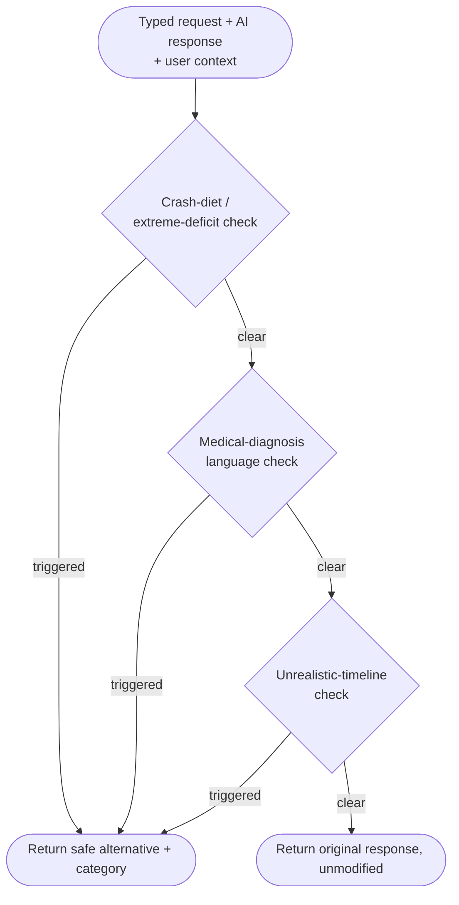
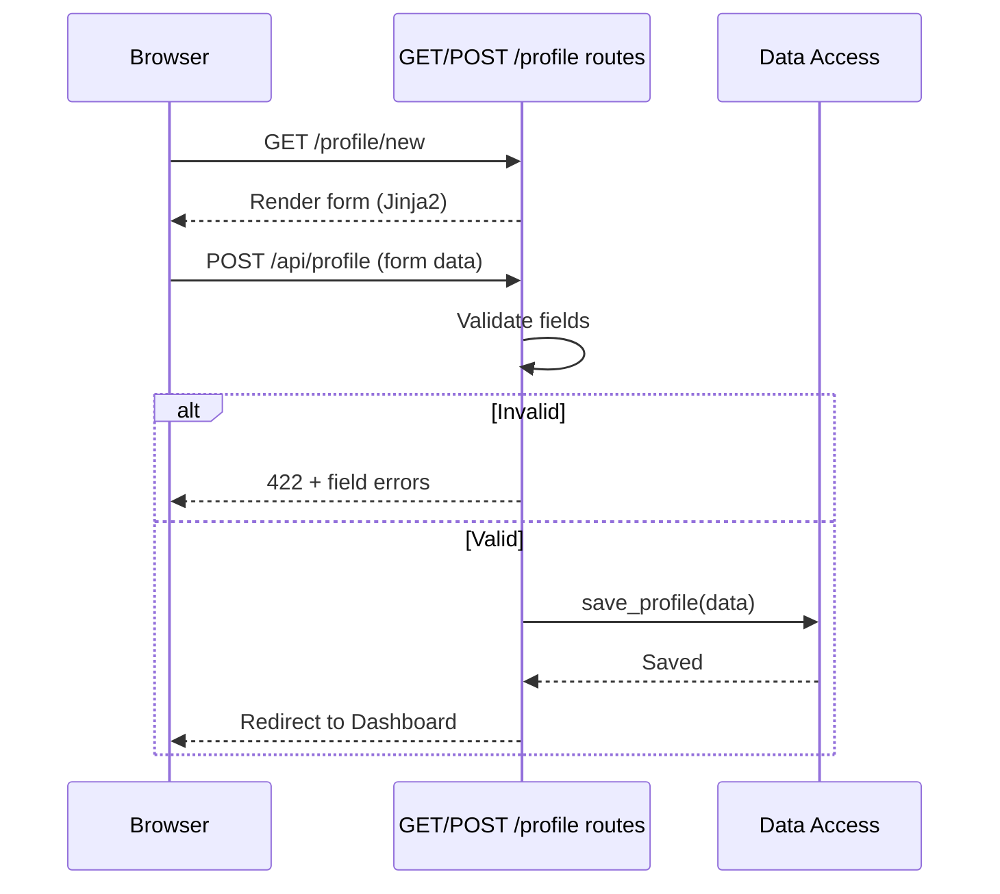
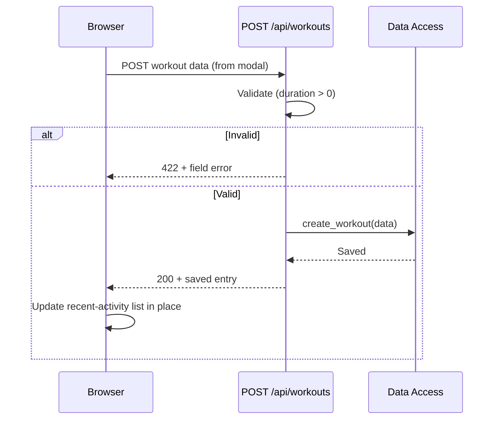
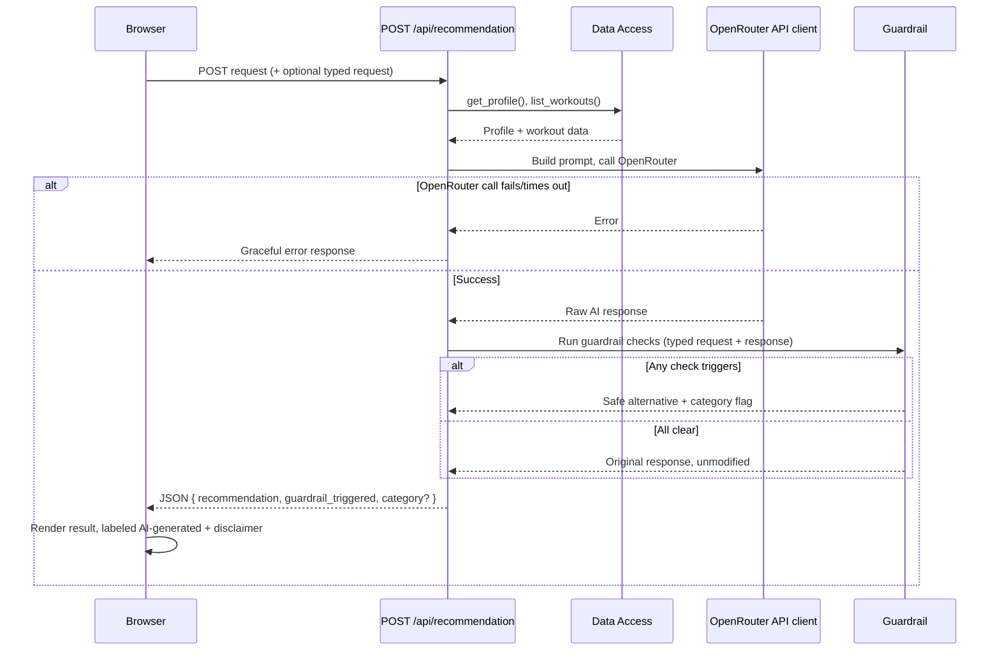
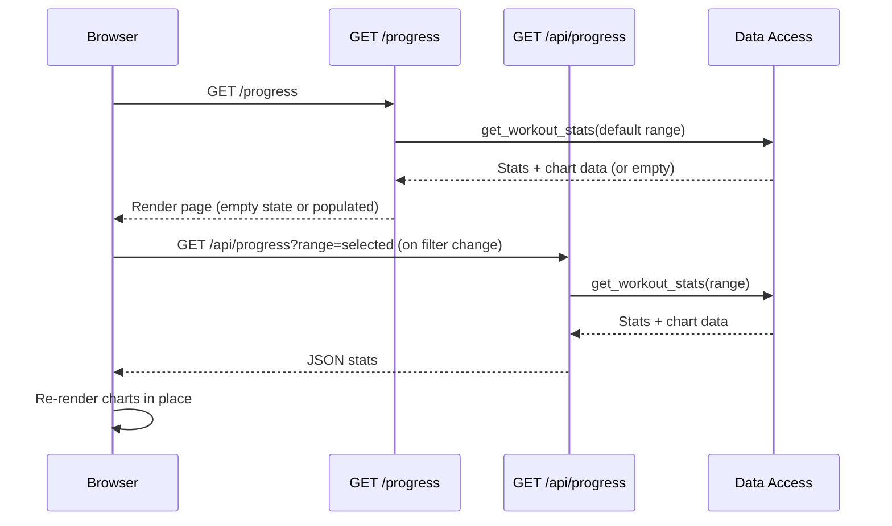

# High-Level Design (HLD)
## Personal Fitness Tracker AI Assistant

| | |
|---|---|
| **Status** | Draft v1 |
| **Owner** | Mohd Sahnoon |
| **Date** | 2026-07-18 |
| **Depends on** | [system-design.md](./system-design.md) |

---

## 1. Overview

System Design named the components and validated one representative flow end to end. HLD breaks
each component into its internal responsibilities, defines the route-level API contract (paths
and purposes — not full request/response schemas, that's LLD), and produces a sequence diagram
for every flow, not just the AI Recommendation one. It also resolves the two questions System
Design deferred: how the guardrail actually checks responses, and which model the AI client
calls.

## 2. Decisions Locked In (HLD-level)

| Decision | Choice | Why |
|---|---|---|
| Guardrail implementation | Rule-based, deterministic checks | Reproducible for a live demo, no added latency/cost from a second AI call, and directly testable against PRD Feature 5's acceptance criteria |
| AI model | `google/gemma-4-31b-it:free` via OpenRouter, model name read from an env variable | Instruction-tuned chat model suited to generating natural-language recommendations; free tier fits the no-budget constraint |
| Guardrail placement in the request lifecycle | Runs synchronously inside the `/api/recommendation` route, before any response is sent to the browser | Matches System Design's mandatory-checkpoint requirement — unchanged, just confirmed at this level of detail |

**Note carried forward:** free-tier models can be rate-limited or occasionally unavailable — this
is exactly the kind of failure the existing PRD Feature 3 AC3 ("service call fails → graceful
error, not broken UI") already has to handle, so no new requirement, just a reason that
requirement will actually get exercised.

**Note on the guardrail's exact rules:** this document establishes *that* the guardrail runs
three deterministic checks (crash-diet/extreme-deficit, medical-diagnosis language, unrealistic
timeline) and *what happens* when one fires. The precise thresholds, keyword/pattern lists, and
fallback response copy are a testable spec in their own right — that's the next stage (NFRs &
Guardrail Spec), not decided here, to avoid guessing at numbers that stage should own.

## 3. Route-Level API Contract (paths and purpose only)

### Page routes (Jinja2 → HTML)

| Method & Path | Renders | Notes |
|---|---|---|
| `GET /` | Dashboard, or redirects to `/profile/new` | Redirect happens if no profile exists yet |
| `GET /profile/new` | Profile Setup form | Entry point for a first-time user |
| `GET /workouts` | Workout History | Reached via a link from the Dashboard's recent-activity list |
| `GET /progress` | Progress View | Initial render uses a default range (e.g. week); range changes happen client-side via the API route below |

### API routes (JSON, called via `fetch()` from vanilla JS)

| Method & Path | Purpose | Calls |
|---|---|---|
| `POST /api/profile` | Validate + save profile, compute BMI/calorie estimate | Data Access |
| `POST /api/workouts` | Validate + save a workout entry | Data Access |
| `GET /api/workouts` | Return workout history data (used to refresh the Dashboard's recent-activity list after a save) | Data Access |
| `POST /api/recommendation` | Orchestrate the full AI Recommendation flow, using profile + workout history plus an optional user-typed free-text request (PRD Feature 3 AC5, added 2026-07-18) | Data Access → OpenRouter API client → Guardrail |
| `GET /api/progress?range=` | Return aggregated stats + chart data for the selected time range | Data Access |

**UI wiring note:** Log Workout and AI Recommendation are modal/panel interactions on the
Dashboard (per [wireframes.md](./wireframes.md) screens 3 & 5's windowed framing, not full page
navigation) — they call their API routes via `fetch()` and update the DOM in place, consistent
with System Design's stated split between full page loads and in-place JSON actions.

## 4. Component Internals

### 4.1 Guardrail Module

Three independent checks, run in sequence against the combined text of the user's typed request
(if any) and the raw AI response (**amended 2026-07-18** — originally response-only; see
[nfr-guardrail-spec.md](./nfr-guardrail-spec.md) §2 for why), plus relevant profile/goal context
where a check needs it:

Each check is independent and short-circuits on the first trigger — the guardrail doesn't need to
run all three once one has already fired, since only one substitute response is returned per
request.

### 4.2 OpenRouter API Client

Responsibilities: build the prompt from profile + recent workout context, call OpenRouter with
the configured model, handle timeout/failure by raising a typed error the API route can catch
(feeds PRD Feature 3 AC3), and return the raw text response — never sanitized or guardrail-checked
itself, that's the guardrail module's job, not the client's.

### 4.3 Data Access Layer

Named functions, not yet schema'd (LLD's job):

| Function | Used by |
|---|---|
| `get_profile()` / `save_profile(data)` | Dashboard, Profile Setup, AI Recommendation context |
| `create_workout(data)` / `list_workouts(order="recent")` | Log Workout, Workout History, Dashboard recent-activity |
| `get_workout_stats(range)` | Progress View (totals + chart series) |

## 5. Sequence Diagrams (per flow)

### 5.1 Profile Setup

### 5.2 Log a Workout

### 5.3 Request an AI Recommendation

### 5.4 View Progress

## 6. Error Handling Pattern (established here, formalized in NFRs next)

Two consistent patterns across every API route, so LLD can encode them precisely rather than each
route inventing its own shape:
- **Validation failure** → structured 422 response with field-level messages (Profile Setup,
  Log Workout).
- **Upstream failure** (OpenRouter unreachable/timeout) → graceful error response the frontend can
  render as a retry state, never a raw exception or broken UI (AI Recommendation).

## 7. Open Questions (deferred to NFRs & Guardrail Spec)

- Exact numeric thresholds for the crash-diet and unrealistic-timeline checks.
- Exact keyword/pattern lists for the medical-diagnosis check.
- Exact fallback response copy shown when each guardrail category triggers.
- Exact structured shape of the 422/error JSON bodies (field names, error codes).
