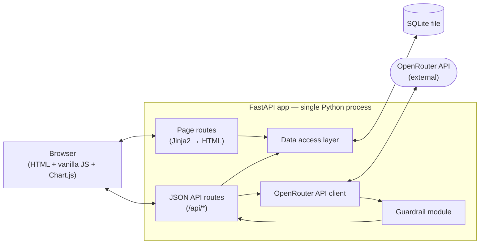
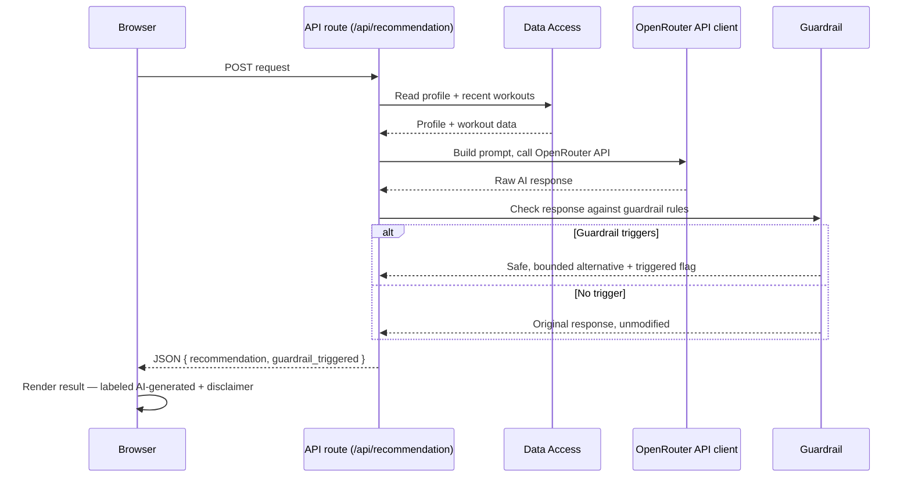

# System Design
## Personal Fitness Tracker AI Assistant

| | |
|---|---|
| **Status** | Draft v1 |
| **Owner** | Mohd Sahnoon |
| **Date** | 2026-07-18 |
| **Depends on** | [PRD.md](./PRD.md), [user-flows.md](./user-flows.md), [wireframes.md](./wireframes.md) |

---

## 1. Overview

This is the first stage that moves from product language into engineering language: what runs
where, what talks to what, and why. It defines the architecture shape and tech stack; HLD (next)
breaks each component down further and adds sequence diagrams per flow; LLD (after that) defines
exact data models and API contracts.

## 2. Decisions Locked In

| Decision | Choice | Why |
|---|---|---|
| Deployment | Local only | No budget, solo/demo project — matches BRD constraints |
| Architecture | Single-process, 3-tier | Browser ↔ FastAPI app ↔ SQLite file — no separate services to run or deploy |
| Backend framework | FastAPI (Python) | Owner's strongest language; keeps the logic they most need to trust (the guardrail) in code they can read |
| Frontend | Jinja2 server-rendered templates + vanilla JS + Chart.js (CDN) | No Node/npm/bundler toolchain; one primary language across the codebase |
| Data store | SQLite (embedded file) | Zero-config, real SQL, no hosting account, portable — fits solo/no-budget scope |
| Auth | None | Single-user local app (PRD §6) |
| AI provider | OpenRouter API, called **server-side only** — model is not Claude | API keys must never be exposed to the browser regardless of provider — that part is a security requirement, not a preference. The provider/model choice itself is a flagged deviation, see below. |
| Guardrail placement | Server-side, inside the API layer | Must run on every AI response before it reaches the client, so it can't be bypassed by tampering with client code |

**Flagged deviation:** the hackathon brief explicitly says *"use Claude to suggest next steps."*
Routing through OpenRouter with a non-Claude model is a deliberate departure from that — noted
here rather than silently swapped, same discipline as every other conflict surfaced earlier in
this doc sequence. Since this project's actual objective ([BRD.md](./BRD.md) §1, §6) is a personal
learning/demo project rather than a graded submission, this is a reasonable call — flagging it so
it's a decision you're aware you made, not a detail that quietly drifted.

## 3. Architecture Diagram

**Notes**
- Full page loads (Profile Setup, Dashboard, Workout History, Progress View) are served as HTML
  by Jinja2 page routes — the browser gets a rendered page, not a client-side app shell.
- Interactive actions that don't need a full page reload (submitting a workout, requesting a
  recommendation, changing the progress time-range filter) hit the JSON API routes from vanilla
  JS via `fetch()`, and update the DOM in place.
- Every external AI call flows through the guardrail before any response reaches the browser —
  there is no code path where a raw Claude response reaches the client unchecked.

## 4. Component Responsibilities

| Component | Responsibility |
|---|---|
| **Page routes** | Render full HTML pages (Jinja2 templates) for navigable screens; read via Data Access layer |
| **API routes** | Handle discrete actions (log workout, request recommendation, fetch progress data) as JSON endpoints |
| **Guardrail module** | Inspect AI responses for the three PRD-defined triggers (crash diet, medical claim, unrealistic timeline) before they're returned; substitutes a safe alternative and flags when triggered |
| **OpenRouter API client** | Builds prompts from profile + workout context, calls the OpenRouter API (model configurable), returns the raw response internally (never directly to the browser) |
| **Data access layer** | All reads/writes to SQLite — profile, workouts; the only component that touches the database directly |
| **SQLite file** | Single-user data store; entities and schema are an LLD decision, not detailed here |

## 5. Request Lifecycle — AI Recommendation (representative flow)

The AI Recommendation flow is the architecturally interesting one (external API + guardrail
branch), so it's worth validating end-to-end at this stage rather than waiting for HLD.

This matches [user-flows.md](./user-flows.md) Flow 3 exactly, just one layer more technical — the
guardrail is confirmed as a mandatory step inside the API route, not an optional post-process.

## 6. Data Entities (named, not modeled)

Two entities are enough for this scope — full schema (columns, types, constraints, relationships)
is an LLD decision:

- **Profile** — one row, single user (name, age, fitness goal, height, weight)
- **Workout** — many rows, one per logged activity (type, duration, how it felt, timestamp)

## 7. Non-Functional Notes (architecture-level only)

A full NFR document comes later in the sequence; a few things worth deciding now because they
affect the architecture directly:

- **Concurrency:** single-user, single local process — no need to design for concurrent writes or
  connection pooling. SQLite's default locking is more than sufficient.
- **Secrets:** the OpenRouter API key is loaded from an environment variable (e.g. via a `.env`
  file), never hardcoded or committed. Confirm `.gitignore` excludes it before the first commit
  that adds one.
- **Failure isolation:** an AI service failure (Feature 3, AC3) must not affect the rest of the
  app — Profile, Workout Logging, and Progress View all function independently of the AI
  Recommendation component being up.

## 8. Out of Scope for This Design

Deliberately not designed for for, consistent with BRD/PRD scope: multi-user data isolation,
horizontal scaling, caching layers, background job queues, real-time updates (websockets). None
of these are needed for a single-user local demo, and adding them now would be premature.

## 9. Open Questions (deferred to HLD)

- **Guardrail implementation approach** — rule-based checks (keyword/pattern matching on the
  response) vs. a second AI call acting as a moderator. Not decided here; HLD will specify which,
  since it changes the guardrail module's internal design meaningfully.
- **Specific model choice via OpenRouter** — which model (and fallback behavior if that model or
  OpenRouter itself is unavailable) is a build-time/LLD detail, not an architecture decision. Not
  yet specified — needed before LLD is drafted.
