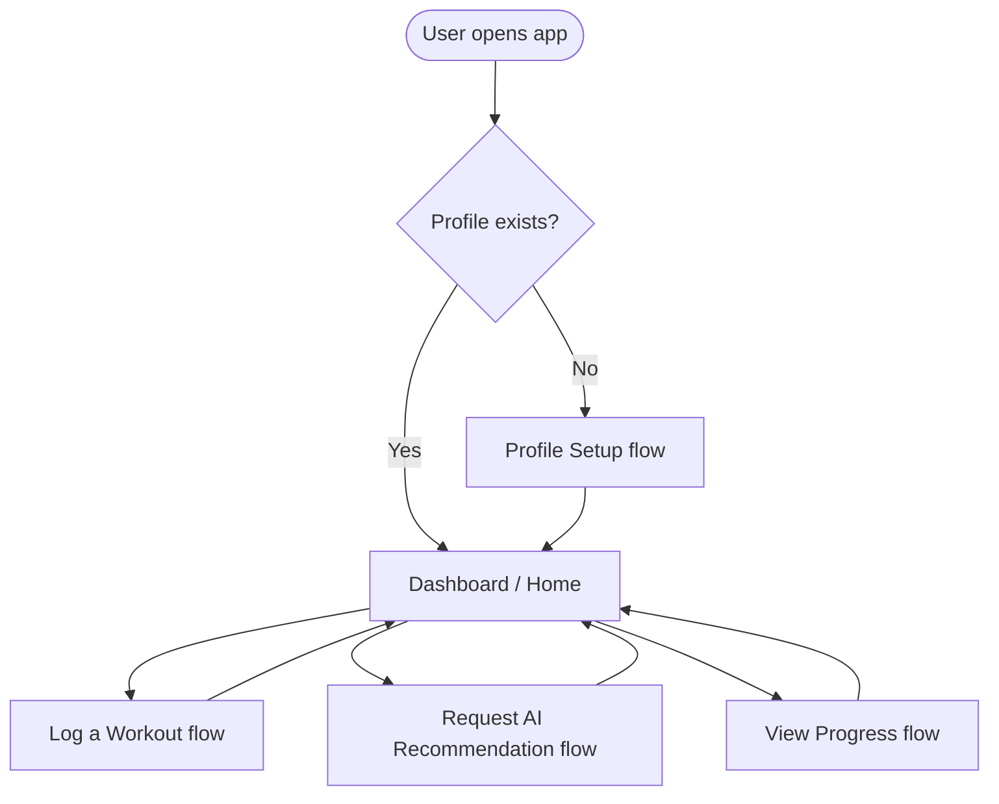
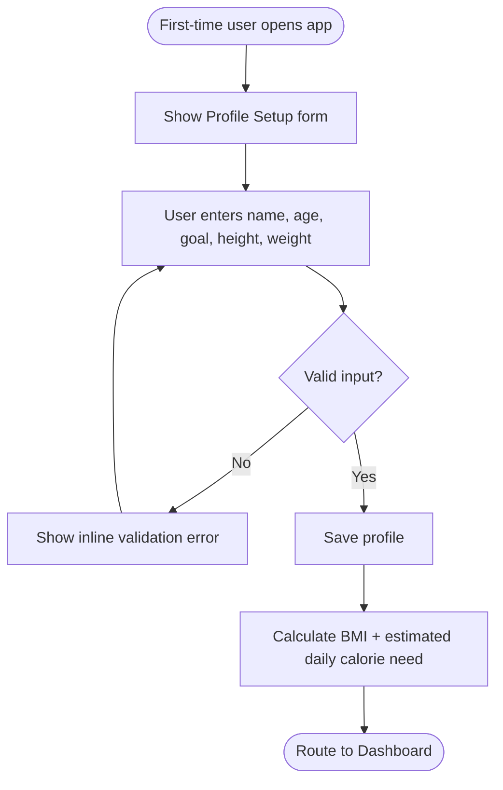
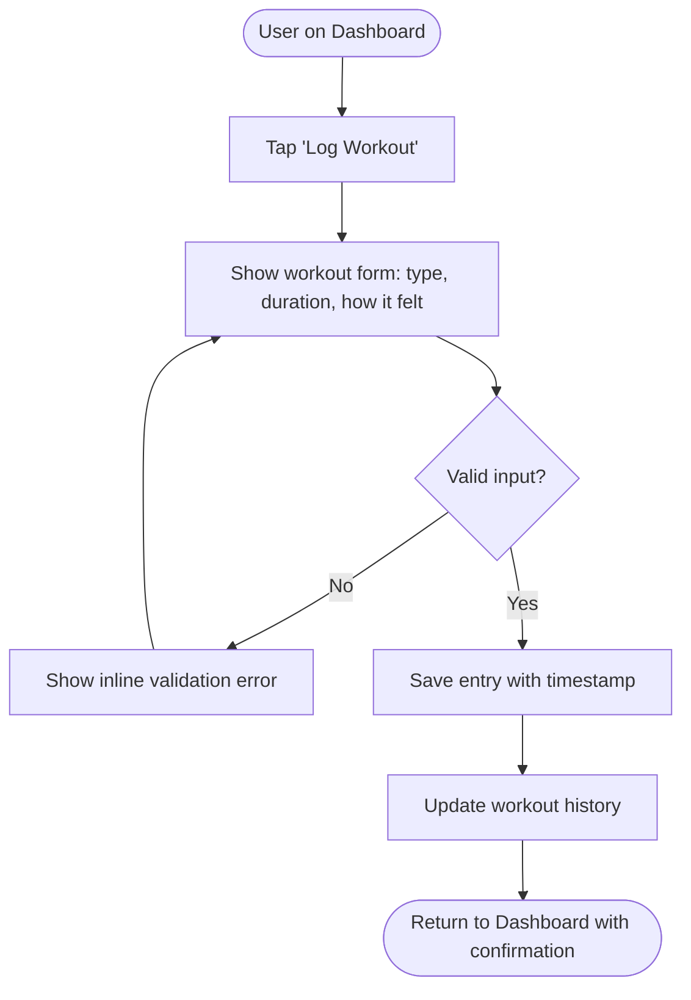
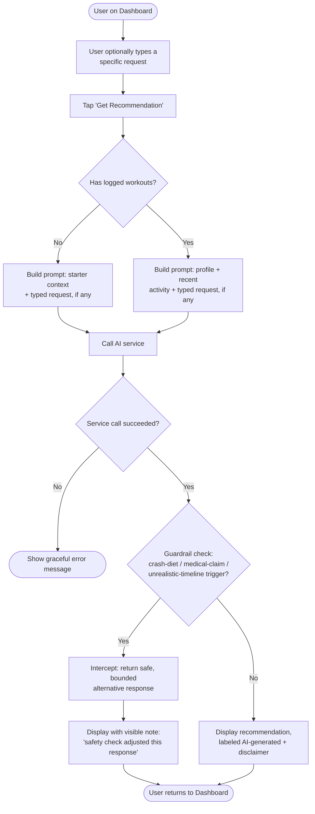
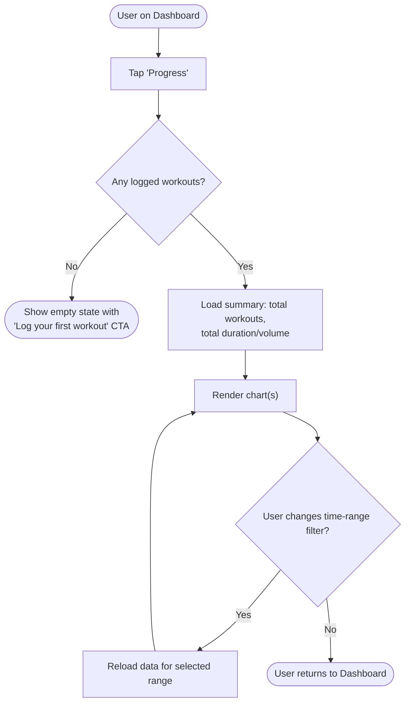

# User Flows / Flowcharts
## Personal Fitness Tracker AI Assistant

| | |
|---|---|
| **Status** | Draft v1 |
| **Owner** | Mohd Sahnoon |
| **Date** | 2026-07-18 |
| **Depends on** | [PRD.md](./PRD.md) |

---

These are **user-journey level** flows — what the user sees and decides, screen to screen. They
stay at the level of "what happens," not "how it's implemented" (no API calls, no data models —
that's System Design/HLD next). Each flow maps to acceptance criteria already defined in the PRD;
where relevant, error and empty-state branches are included because they're explicitly tested by
the PRD's acceptance criteria, not just happy-path decoration.

Diagrams use Mermaid so they render directly on GitHub and in most markdown viewers.

---

## 0. App Navigation Map (overview)

How the four flows below connect. This is the frame everything else sits inside.

---

## 1. Onboarding — Profile Setup

**Maps to:** PRD Feature 1 (User Profile Setup), AC1–AC3.

**Notes**
- "Valid" means: age > 0 and realistic, height/weight > 0 (ties to PRD AC2).
- BMI + calorie estimate are computed once on save and shown on the Dashboard (AC3) — the exact
  formula (e.g. Mifflin-St Jeor) is an LLD decision, not decided here.

---

## 2. Log a Workout

**Maps to:** PRD Feature 2 (Workout / Activity Logging), AC1–AC3.

**Notes**
- "Valid" means duration > 0 at minimum (PRD AC2).
- History ordering (most-recent-first) is enforced wherever history is displayed, not just here.

---

## 3. Request an AI Recommendation (with Safety Guardrail)

**Maps to:** PRD Feature 3 (AI Recommendations) AC1–AC4, and Feature 5 (Safety Guardrail) AC1–AC4.
This is the most decision-heavy flow — the guardrail is a branch inside it, not a separate screen.

**Notes**
- The optional free-text field (added 2026-07-18 — see PRD Feature 3 AC5) is what makes the
  guardrail concretely demoable: type an unsafe request, watch it get caught.
- **Amendment (2026-07-18, see [nfr-guardrail-spec.md](./nfr-guardrail-spec.md) §2):** the
  guardrail checks the user's typed request *and* the AI's response together, not the response
  alone — a well-behaved model often won't produce a clean diagnosis for the guardrail to catch on
  the output side, so checking input too is what makes the guardrail reliably demoable.
- The guardrail runs on every AI response before display — it's not optional or skippable per
  request.
- The three trigger categories (crash diet, medical claim, unrealistic timeline) come directly
  from PRD Feature 5's decided scope — no other categories are in scope yet.
- "Visible note" satisfies PRD AC4: the guardrail must be transparent, not a silent swap.

---

## 4. View Progress

**Maps to:** PRD Feature 4 (Progress View), AC1–AC3.

**Notes**
- Empty state (AC2) is a first-class branch, not an afterthought — it's the state every
  first-time user hits immediately after onboarding, before their first log.
- The more technical version of this flow (API calls, aggregation steps) already exists as
  pseudocode in [breakdown.md](./breakdown.md)'s "Hidden Flow" section — that will be formalized
  into a proper sequence diagram at the HLD stage rather than repeated here.

---

## Open Questions

- None currently — all four flows trace directly to confirmed PRD acceptance criteria. Flag
  anything here if a flow doesn't match how you'd expect the app to behave.
